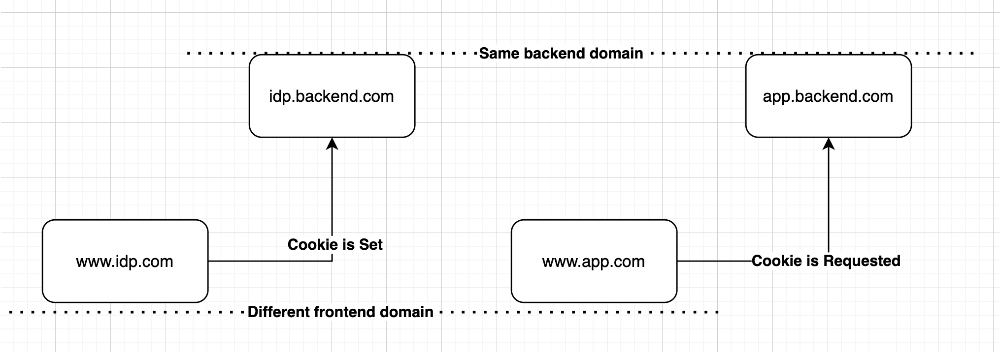

# Project Setup Guide

How to share signed cookie .

## Step 1: Configure Local Domains

We need to configure the local domains in the system's hosts file. 

### On Mac:

1. Open Terminal.
2. Type `sudo nano /etc/hosts` and press `Enter`. You'll be prompted to enter your password.
3. Add these lines to the end of the file:

127.0.0.1 www.idp.com
127.0.0.1 www.app.com
127.0.0.1 idp.backend.com
127.0.0.1 app.backend.com

4. Press `Control + X` to exit, then `Y` to save the changes, and finally `Enter` to confirm.

### On Windows:

1. Open Notepad as Administrator (Right-click on Notepad -> Run as Administrator).
2. Click File -> Open, then navigate to `C:\Windows\System32\Drivers\etc` and select `All Files (*.*)` from the drop-down menu in the lower right corner.
3. Open the `hosts` file and add these lines at the end:

127.0.0.1 www.idp.com
127.0.0.1 www.app.com
127.0.0.1 idp.backend.com
127.0.0.1 app.backend.com

4. Save and close the file.

## Step 2: Run Docker Compose

After setting up the domains, you need to build and run the Docker environment. 

1. Open Terminal (or Command Prompt on Windows).
2. Navigate to the directory containing the `docker-compose.yml` file.
3. Run `docker-compose up --build`. 

Docker Compose will build the images and start the containers as specified in the `docker-compose.yml` file. 

## Diagram Reference

For a visual representation of the overall system architecture, please refer to `diagram.png` in the project directory.

## Navigate

https://www.idp.com

If you encounter any problems during the setup process, please reach out for assistance.

